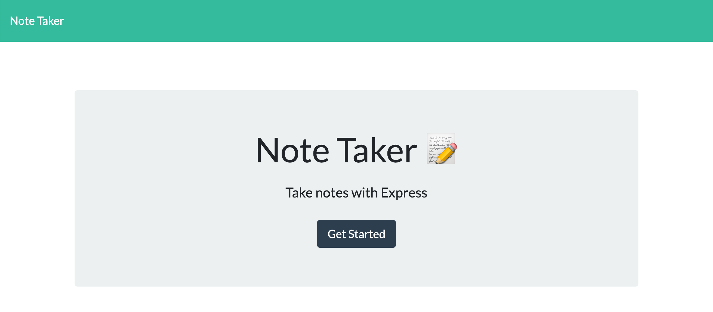
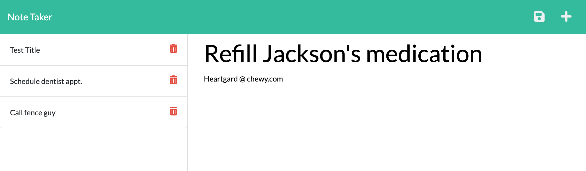

# 11 Express.js: Note Taker

 

## Note for grader:

Please clone repo, then 'npm install', then 'npm start', then open browser to localhost:3000. You do not need to type in 'node index.js' as this is an unnecessary step. If you want to type in 'node app/index.js' after you type in 'npm start' it will just tell you that the server is running on port 3000. The previous grader typed in 'node index.js' which will not work because my index file is in the app folder. That is why in my package.json I have "start": node app/index.js so that it takes care of this step for you when you type 'npm start'. I used my professors node starter template and all of these files are setup differently and it caused confusion. I will not use these anymore. Thank you!

## Description

An application called Note Taker that can be used to write and save notes using an Express.js back-end and JSON

### Live Deployment

https://tranquil-oasis-42231.herokuapp.com/

### Screen shots

index page:

notes page:

## Table of Contents

- [Installation](#installation)
- [Usage](#usage)
- [License](#license)

## Installation

_Steps required to install this project and get the application running:_

git clone repo, npm i, npm start, open browser to localhost:3000

## Usage

_Instructions for use:_
When running npm start it should open up your Note Taker on local host, and the user will be able to ENTER, SAVE, and DELETE notes.

## License

Open

### Questions?

For any questions, please contact me with the information below:

GitHub: [@AF-cmdZ](https://api.github.com/users/AF-cmdZ)
